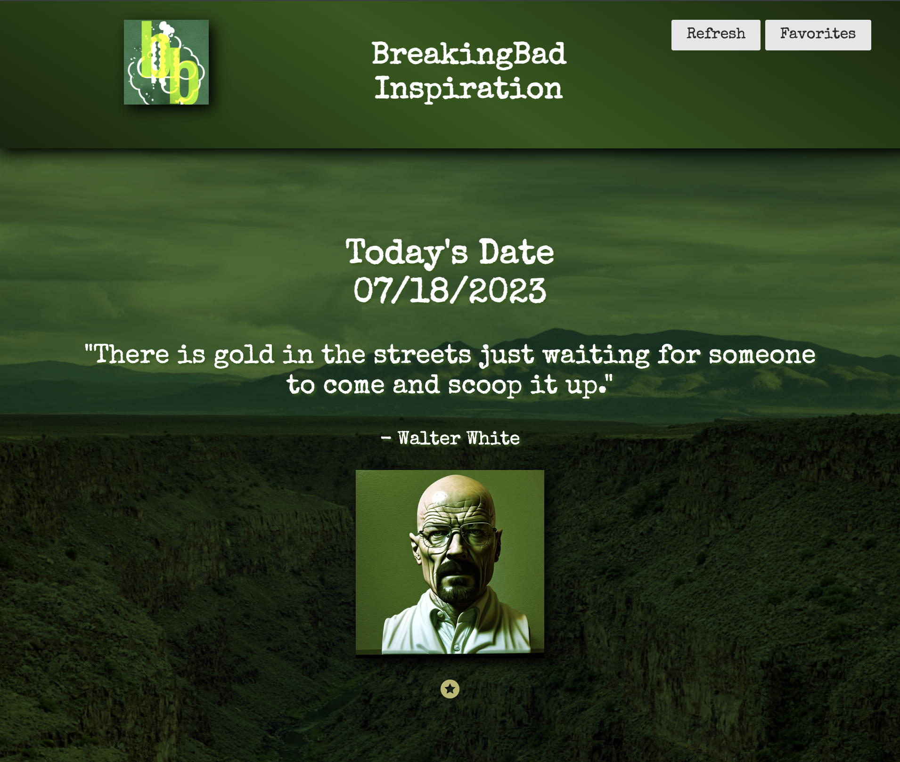

# Breaking Bad Quote DashBoard

## Technology Used

| Technology Used             |                                                    Resource URL                                                    |
| --------------------------- | :----------------------------------------------------------------------------------------------------------------: |
| HTML                        |       [https://developer.mozilla.org/en-US/docs/Web/HTML](https://developer.mozilla.org/en-US/docs/Web/HTML)       |
| CSS                         |        [https://developer.mozilla.org/en-US/docs/Web/CSS](https://developer.mozilla.org/en-US/docs/Web/CSS)        |
| Git                         |                                    [https://git-scm.com/](https://git-scm.com/)                                    |
| JavaScript                  | [https://developer.mozilla.org/en-US/docs/Web/JavaScript](https://developer.mozilla.org/en-US/docs/Web/JavaScript) |
| AOS                         |                       [https://michalsnik.github.io/aos/](https://michalsnik.github.io/aos/)                       |
| Pure CSS                    |                                     [https://purecss.io/](https://purecss.io/)                                     |
| Breakingbad quote generator |                          [https://breakingbadquotes.xyz/](https://breakingbadquotes.xyz/)                          |
| Unsplash                    |                         [https://unsplash.com/developers](https://unsplash.com/developers)                         |
| Dayjs                       |       [https://cdn.jsdelivr.net/npm/dayjs@1/dayjs.min.js](https://cdn.jsdelivr.net/npm/dayjs@1/dayjs.min.js)       |

## Description

[Visit the Deployed Site](https://jarell-chinn.github.io/BreakingBad_Dashboard/)

This is a dashboard inspired by the show Breaking Bad that gives you random quotes from the show as well as an AI generated image of the character who said the quote. You are able to save your favorite quotes to a favorites list at the bottom of the site. This site also generates a random image of New Mexico as a background of the site.

## Usage

# Learning points/Features

1. We have a dynamically added favorites list that pulls from local storage so you get to keep your favorite quotes.

2. A refresh button that generates a new quote, background, and pfp.

## Aurthor Info

Chris Larson

- [Github](https://github.com/larsonwerks)

Justin Choi

- [Github](https://github.com/justinschoi93)

Jarell Chinn

- [Github](https://github.com/Jarell-Chinn)
