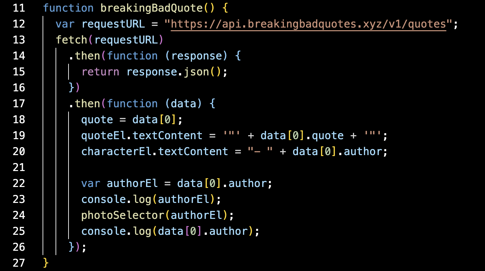

# Breaking Bad Quote DashBoard

## Technology Used

| Technology Used             |                                                    Resource URL                                                    |
| --------------------------- | :----------------------------------------------------------------------------------------------------------------: |
| HTML                        |       [https://developer.mozilla.org/en-US/docs/Web/HTML](https://developer.mozilla.org/en-US/docs/Web/HTML)       |
| CSS                         |        [https://developer.mozilla.org/en-US/docs/Web/CSS](https://developer.mozilla.org/en-US/docs/Web/CSS)        |
| Git                         |                                    [https://git-scm.com/](https://git-scm.com/)                                    |
| JavaScript                  | [https://developer.mozilla.org/en-US/docs/Web/JavaScript](https://developer.mozilla.org/en-US/docs/Web/JavaScript) |
| AOS                         |                       [https://michalsnik.github.io/aos/](https://michalsnik.github.io/aos/)                       |
| Pure CSS                    |                                     [https://purecss.io/](https://purecss.io/)                                     |
| Breakingbad quote generator |                          [https://breakingbadquotes.xyz/](https://breakingbadquotes.xyz/)                          |
| Unsplash                    |                         [https://unsplash.com/developers](https://unsplash.com/developers)                         |
| Dayjs                       |       [https://cdn.jsdelivr.net/npm/dayjs@1/dayjs.min.js](https://cdn.jsdelivr.net/npm/dayjs@1/dayjs.min.js)       |
| Font Awesome                |                                [https://fontawesome.com/](https://fontawesome.com/)                                |

## Description

[Visit the Deployed Site](https://jarell-chinn.github.io/BreakingBad_Dashboard/)

- As a Breaking Bad fan the user wants to read a quote and see an image of a character from the show. (calls breaking bad quote api)
  
- The Breaking Bad fan wants an immersive experience and view high definition landscapes from New Mexico - the location of the Breaking Bad story. (calls unsplash images api)
  
- The user wants to store all of their favorite quotes from prior visits.
- The user wants a button to fetch a new quote and fetch a new image during their visit

## CSS Frame works

Pure CSS to create grids and measure units for content for each element. Also makes buttons that we can customize. The link to the docs are within the technology used area of this README

## Usage

## All the features and mobile compatibility

# Learning points/Features

1. We have a dynamically added favorites list that pulls from local storage so you get to keep your favorite quotes.

2. A refresh button that generates a new quote, background, and pfp.

3. Animated elements on the page.

4. A Clear button to clear localstorage and current favorited quotes.

5. Shows the current date when opened.

## Aurthor Info

Chris Larson

- [Github](https://github.com/chlarson74)

Justin Choi

- [Github](https://github.com/justinschoi93)

Jarell Chinn

- [Github](https://github.com/Jarell-Chinn)
